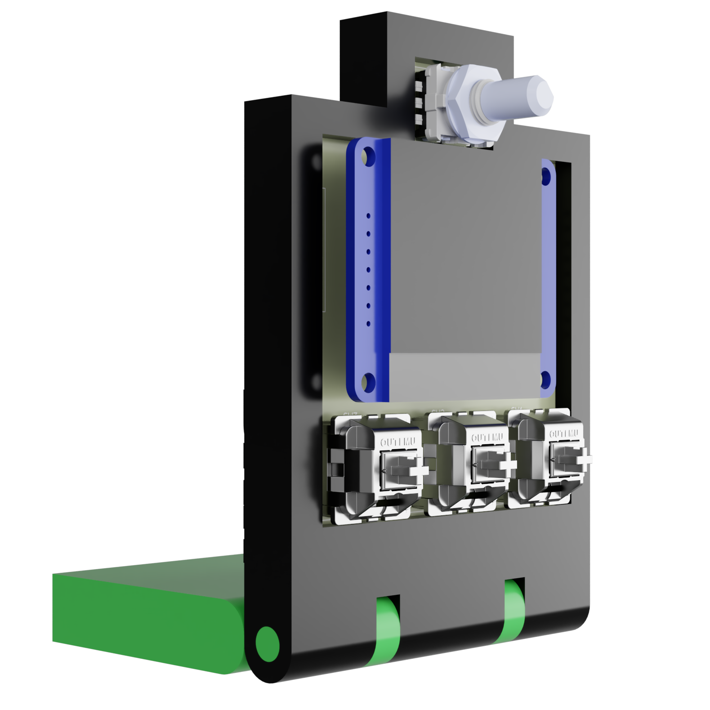
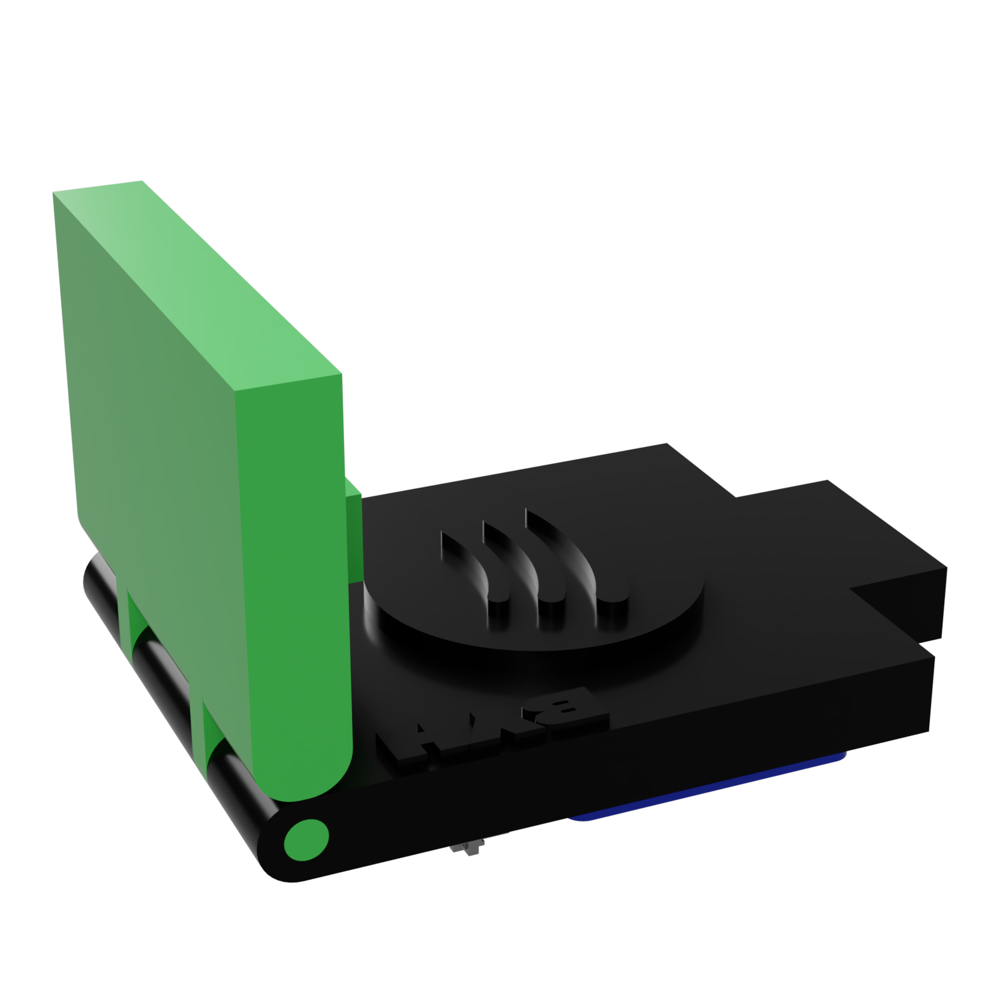

<div align="center">

# 

a physical spotify controller

<p>


</p>

### *a dedicated physical interface for controlling spotify.*


</div>

---

# Overview

**spotube** is a compact physical spotify controller built around an **esp32-s3**, 1.5" lcd, mechanical switches, and a rotary encoder.

it provides physical controls for spotify playback while displaying the current track.

---

# Gallery

<div align="center">





</div>

---

# Features

* spotify integration
* esp32-s3
* 1.5" ips display
* cherry mx switches
* ec11 rotary encoder
* wi-fi
* custom pcb
* custom enclosure
* physical playback controls

---

# hardware stack

| component    | description             |
| ------------ | ----------------------- |
| mcu          | waveshare esp32-s3 mini |
| display      | waveshare 1.5" ips lcd  |
| switches     | cherry mx               |
| encoder      | ec11                    |
| connectivity | wi-fi                   |
| pcb          | custom kiCad design     |
| case         | custom 3d printed       |

---

# Assembly

## 1. order the pcb

generate gerbers from:

```bash
PCB/Spotube.kicad_pcb
```

and send them to your preferred manufacturer.

## 2. order components

all components are listed in:

```bash
BOM.csv
```

## 3. assemble

* solder the switches
* solder the ec11 encoder
* install the esp32-s3
* connect the display
* assemble the enclosure
* install the keycaps

---

# firmware

firmware is located in:

```bash
spotube.ino
```

the firmware handles:

* wi-fi
* spotify api
* display
* buttons
* rotary encoder

## setup

configure your:

```cpp
wifi ssid
wifi password
spotify client id
spotify client secret
```

then upload the firmware to the esp32-s3.

---

# PCB

designed in **kicad**.

```bash
PCB/
├── Spotube.kicad_pcb
├── Spotube.kicad_sch
├── Spotube.kicad_pro
└── Spotube.kicad_prl
```

---

# Enclosure

the complete assembly is available as:

```bash
Assembly.step
```

and the stl files for enclosures is available as:

```bash
Bottom.stl
Upper.stl
Rod.stl
```

designed around the custom pcb and components.

---

# BOM

|Name                                                                                   |Purpose        |Cost Per Item (USD)|Quantity|Total (USD)|Link                                                                                                                                                                                                                                                                                                                                                                                                                                                                                                                                                                          |Distributor|
|---------------------------------------------------------------------------------------|---------------|-------------------|--------|-----------|------------------------------------------------------------------------------------------------------------------------------------------------------------------------------------------------------------------------------------------------------------------------------------------------------------------------------------------------------------------------------------------------------------------------------------------------------------------------------------------------------------------------------------------------------------------------------|-----------|
|3D print model                                                                         |Shell          |5.0                |1       |5.0        |https://github.com/hackclub/print-legion                                                                                                                                                                                                                                                                                                                                                                                                                                                                                                                                      |Hack Club  |
|Cherry MX Keycaps                                                                      |Keycaps        |6.0                |1       |6.0        |https://www.amazon.in/STYLEHEAVEN-Transparent-Keycaps-Cherry-Switches/dp/B0GFP1XJ9Z/ref=sr_1_3?crid=DYB9DOR1TQBR&dib=eyJ2IjoiMSJ9.kKc3HdH17AhE-nTQrQ1SxfVaJhYmeFbPm0835eVz_-jbeImT-htLy8qY5z9y7LFMVcU5GMdK1seMkgmHiR4wWpi1BgtYqCacbU8EvAMouMm7CIndQuxGhQM03HZ5q1YC1rxEzez9aDCuzcTNcX6JDWGt8_kTfs1JOH-BJ0gKga4v_X3wMwq5lh2IEx95DAljB56USbKK-cMQQL0NlOBpbdPy96U8AAuc-0rmg1aAkgo.8iI3E4B-61cjV9iN_8wTP24XBDafzPccAuC3eiihFm8&dib_tag=se&keywords=cherry+mx+keycaps&nsdOptOutParam=true&qid=1773942374&sprefix=cherry+mx+keyca%2Caps%2C375&sr=8-3                                 |Amazon     |
|Cherry MX Switches                                                                     |Switches       |4.0                |1       |4.0        |https://neomacro.in/products/cherry-mx-switches?srsltid=AfmBOopQB-NQ1BO0dVkkvkxVeaQVPTGoN2zvkJHoIvh3QNb6hdRFlXtS                                                                                                                                                                                                                                                                                                                                                                                                                                                              |Neo Macro  |
|M3X4 mm Brass Heat Set Threaded Round Insert Nut - Pack of 6                           |Heatset Inserts|1.0                |1       |1.0        |https://www.amazon.in/M3X4-Brass-Threaded-Round-Insert/dp/B0B9NL8F74/ref=sr_1_6?crid=4XHSG7DE82FX&dib=eyJ2IjoiMSJ9.jSf9pEXSTtLSBrCZPvV8rjy5sJiwLvEN3PXR5QozJPsAiY0a3zu6d2eMFlCtvwc3lazSN3qwL78W-59c-F2lxC8eSm_g7yI2pQcVhqhLF0ZTlcaxr_mBZh80dUTecpa2n2oi8dVloWKQzb8cnK1K6XzuL9LXztnVKEaTjiPcTQCJJVEKcjAfRsyneHSKDAbe3HTdYqj45szwxJxZ59RBY0f4fnIMMKMSxA-nZUmDnciH63nYQ_eTNyiBXuaOVkBy9CxHedxJKnfBrpx4WTrILm3y449EAYZIIWevf4pucFc.ck8xHBHMe4U-TGfCyeApORo9GM7ryFF2eu3gQ-_vovg&dib_tag=se&keywords=M3+Heatset+inserts&qid=1773942041&sprefix=m3+heatset+inserts%2Caps%2C364&sr=8-6|Amazon     |
|Waveshare 1.5inch LCD Module (240×280 IPS)                                             |Screen         |9.49               |1       |9.49       |https://www.waveshare.com/1.5inch-lcd-module.htm                                                                                                                                                                                                                                                                                                                                                                                                                                                                                                                              |Waveshare  |
|Waveshare ESP32-S3 Mini Development Board based on ESP32-S3FH4R2 4MB Flash & 2MB PS RAM|Dev Board      |6.82               |1       |6.82       |https://robu.in/product/waveshare-esp32-s3-mini-development-board-based-on-esp32-s3fh4r2-4mb-flash-and-2mb-ps-ram-without-headers-and-adapter-board-fpc-cable/                                                                                                                                                                                                                                                                                                                                                                                                                |Robu.in    |
|EC11 Rotary Encoder Module with Knob Cap                                               |Rotary Input   |0.98               |1       |0.98       |https://robu.in/product/EC11%20Rotary%20Encoder%20Module%20with%20Knob%20Cap%20for%20Development%20Boards/                                                                                                                                                                                                                                                                                                                                                                                                                                                                    |Robu.in    |

---

# Repository

```text
Spotube/
├── PCB/
├── CAD/
├── Media/
├── Firmware/spotube.ino
├── BOM.csv
└── README.md
```

---

# Current status

* [x] concept
* [x] pcb
* [x] schematic
* [x] enclosure
* [x] firmware
* [ ] final build
* [ ] complete spotify controls

---

# Contributing

contributions and suggestions are welcome.

```bash
git clone https://github.com/Sudo-Aju/Spotube.git
cd Spotube
```

fork → modify → commit → pull request

---

# Creator

### Azmeer Pirani

17 • India • @macondo

built with a love for:

* hardware
* pcb design
* music
* embedded systems
* experimental products

---

# License

This project is licensed under the **MIT license**.

---

<div align="center">

# Spotube

### *your music. your controls.*

</div>
